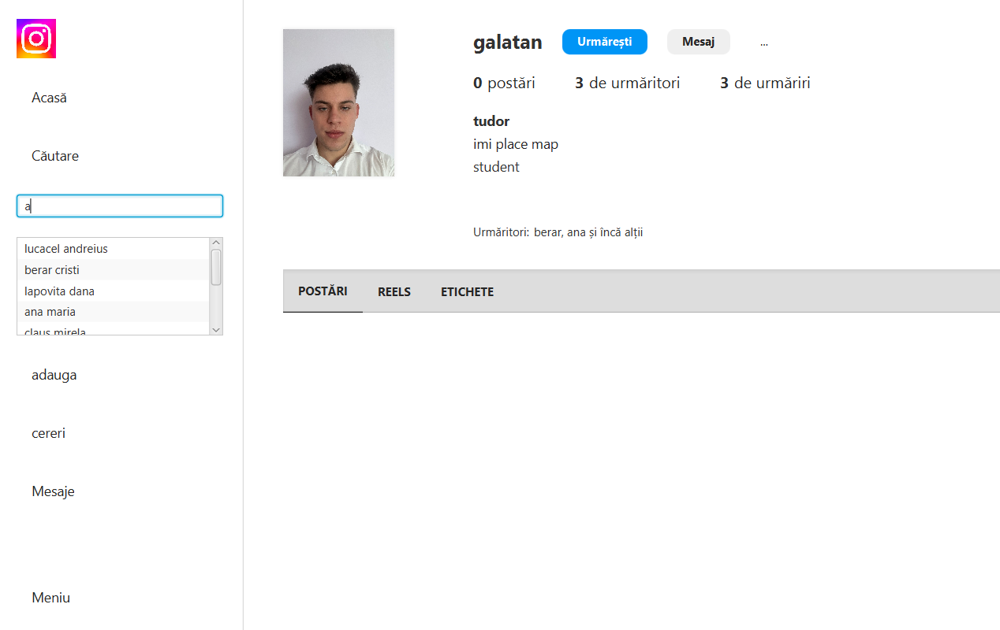

# 📸 Instagram Replica

A desktop replica of Instagram built to **learn and reinforce OOP principles**, apply the **Observer** and **Controller** design patterns, and work with a **PostgreSQL database** and **JavaFX GUI**.

---

## 🎥 YouTube Demo

▶️ [Watch the project demo video here](https://youtu.be/8Grj1V_ZuUY)

---

## 🖼️ Preview



---

## 🧰 Tech Stack

- ☕ Java
- 🖼️ JavaFX
- 🗄️ PostgreSQL
- 🧠 OOP + Design Patterns (Observer, Controller)
- 🛠️ IntelliJ IDEA

---

## 📝 Setup Instructions

1. **Clean and build** the Gradle project.
2. Set the project type to use **JavaFX**.
3. Link the database driver in `build.gradle`:
   ```groovy
   dependencies {
       implementation 'org.postgresql:postgresql:42.7.1'
   }

4. Use ctrl + alt + L to reformat code


Tips:
-check the data in the tables when working with db
An enum is a special "class" in Java used to define a set of constants.
E extends Event = with any event type that implements the Event interface
fetches= a aduce
model = ObservableList
